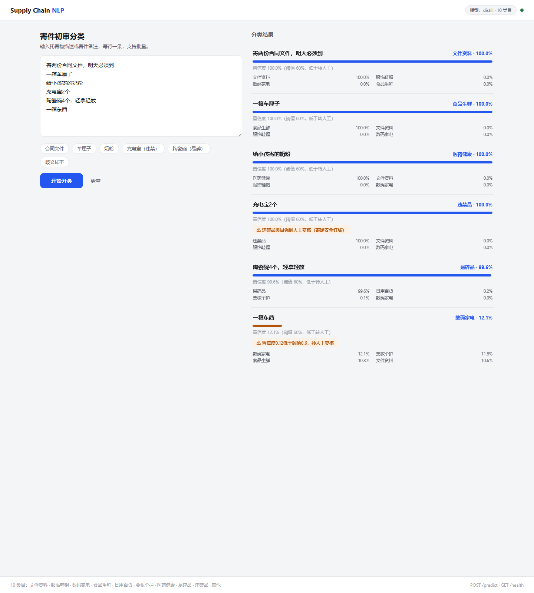
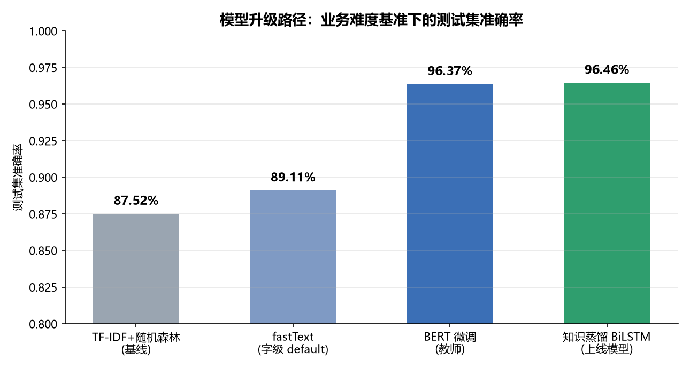
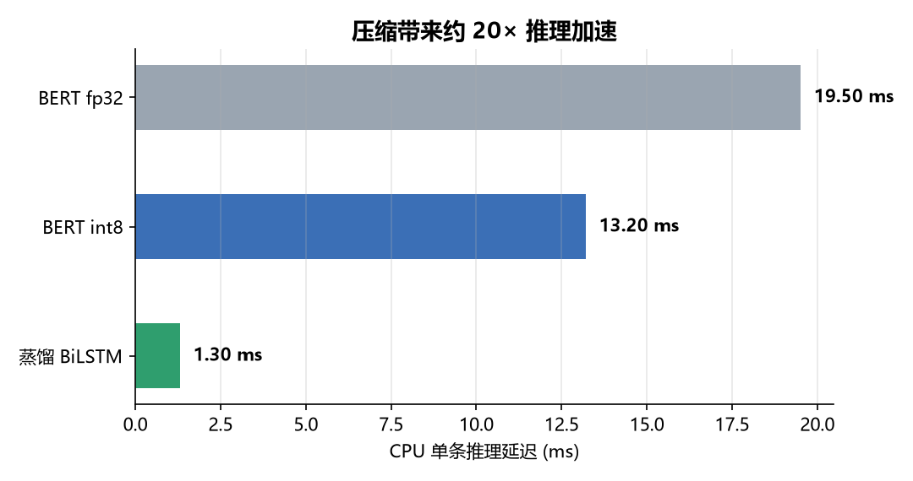
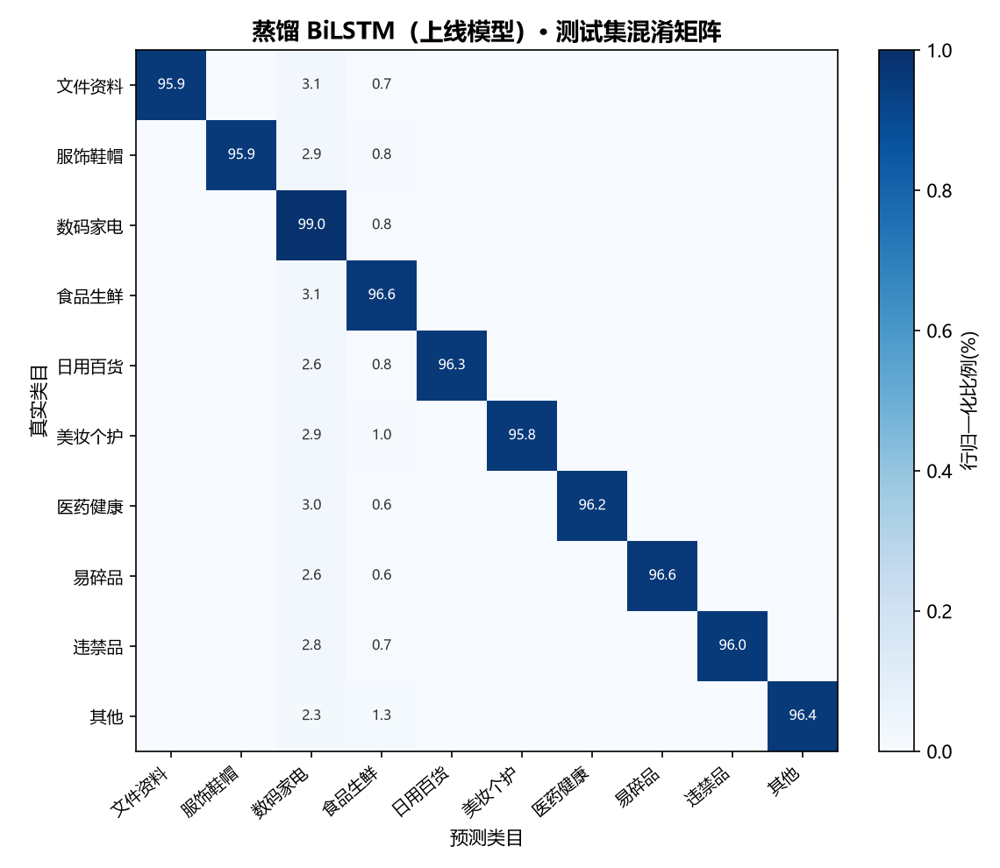

# Supply Chain NLP —— 物流寄递场景寄件文本智能分类系统


> 短文本多分类：把用户下单时填写的**托寄物描述与寄件备注**实时分到 15 个类目，
> 替代人工完成寄件初审的分类环节，支撑自动制单、计费定价与违禁品初筛；
> 快递员复检终判回流形成**真实标签飞轮**，持续驱动模型迭代。
> 技术路径：**词库驱动数据工程（30 万合成语料，P0-P10 门禁）→ BERT 教师 → 知识蒸馏 → FastAPI 部署**。
## 1. 项目背景
寄递业务中，用户下单时填写的托寄物描述和寄件备注（如「寄两份合同文件」「一箱车厘子」「给小孩寄的奶粉」）
原本依赖人工判读类目，才能完成自动制单、计费定价，并拦截违禁品。单量一大人工初审跟不上，
违禁品靠人看容易漏。本项目构建文本自动分类系统，实现：
- 寄件文本实时分到 **15 个类目**：文件证件、服饰鞋包、数码家电、食品生鲜、日用家居、美妆个护、医药保健、
  母婴玩具、图书文娱、运动户外、汽配五金工业品、家具家装、易碎品、违禁限寄、其他/拒识
- **违禁品红线策略**：禁寄词库命中 / 红线类目 / 低置信度 / 未登录词中间带 → 自动转人工复核（多道护栏，不依赖模型置信度单点）
- **真实标签回流**：快递员复检终判 `/feedback` 全量回传 → 多数票聚合 → 正样本池与 badcase 库，驱动后续模型升级
- 行业对标：顺丰丰语大模型（寄件意图识别）、货拉拉（司机侧违禁品识别）、快递100（一句话寄快递）、京东物流（地址解析）
## 2. 系统架构

> 交互版（含暗色主题）：[docs/img/architecture.html](docs/img/architecture.html)
**设计要点**
- **数据先行**：类目对齐中通快运 27 类 / 顺丰 17 组 / 邮政局禁寄 19 子类，定版为 15 类；
  30 万训练语料由 YAML 词库（8000+ 词位）确定性生成，标签零人工标注污染，hash 冻结训练只读
- **红线多护栏**：禁寄词库命中（569 词）→ 强制复核；低置信（<0.60）→ 转人工；未登录词 + 中间带置信 → 转人工——
  三道护栏相互独立，堵住"模型高置信错分"这类单点漏洞（如「小猫」被模型错判日用，护栏仍强制复核）
- **压缩有据**：BERT 教师（六尺验收）→ soft 蒸馏学生，体积 1/19、延迟降低 ~2.8×（GPU 实测），
  上线口径为 21MB 学生模型，普通 CPU 服务器即可承载
- **无状态服务**：权重打进镜像，水平扩容只加副本；训练与推理完全分离
## 3. 数据
> **数据口径声明**：仓库内置数据为**按真实业务分布合成的难度基准**（[data/generate_v2.py](data/generate_v2.py)
> 固定种子生成，`v2.300k-d2` 已冻结），保证公开可复现、不含任何真实运单与个人信息。
> 完整数据卡片与 hash 见 [data/raw_v2/DATASHEET_v2.md](data/raw_v2/DATASHEET_v2.md)。
**工程门禁（P0-P10）**
- **7 项结构化质检 7/7**：0 坏行 / 类极差 0% / 主词覆盖 77.7% / 全局唯一率 76.7% / holdout 零泄漏 / 难例 13.3% / 脏数据 0
- **标签正确性双轨审计**：生成器词池确定性核验（99.3% 可归属）+ 504 条审计分歧逐条人工判定（**0 条真实标签错误**）
- **六把评测尺**：dev（调参）/ test-ID（分布内 15 类均衡）/ test-NEAR（180 近义泛化）/
  test-FAR（27 常识未登录词）/ test-REJECT（500 拒识）/ test-SIM（9993 业务仿真）
- holdout 硬隔离：NEAR/FAR 词形在 train/dev/test-ID 中 **0 泄漏**（考"没见过"的泛化）
| 数据集 | 规模 | 说明 |
|---|---|---|
| 训练集 | 300,000 | 合成托寄物描述+备注，15 类各 2 万；生产口径为脱敏历史运单回流（见 §7） |
| 开发集 | 15,000 | 按验证集效果保存最优权重 |
| 测试集 | test-ID 15,000 + NEAR 180 + FAR 27 + REJECT 500 + SIM 9,993 | 六尺异口，覆盖分布内/泛化/拒识/仿真 |
- 格式：`文本\t类目编号`（与 `data/raw_v2/class.txt` 行号对应），短文本（P95 长度 ≈ 11 字符，BERT 截断长度 32）
## 4. 模型升级路径与成果（实测，六尺同口径）
| 尺 | 教师 BERT | 蒸馏 BiLSTM（上线） |
|---|---|---|
| dev | 0.9995 | 0.9981 |
| test-ID（分布内 15 类均衡） | 0.9996 | 0.9980 |
| test-SIM（生产仿真） | 0.9972 | 0.9944 |
| test-NEAR（近义泛化） | 0.7556 | 0.7167 |
| test-FAR（常识未登录词，27 条） | 1.0000 | 0.8889 |
| test-REJECT（拒识，500 条） | 1.0000 | 1.0000 |
| **违禁限寄召回（test-SIM，一票否决）** | **1.0000** | **0.9928（门槛 ≥0.95 / 目标 ≥0.98 达标）** |
| 违禁限寄 AUROC / PR-AUC | 1.0000 / 1.0000 | 1.0000 / 0.9996 |
| 转人工率 @0.6 | 0.04% | 0.09% |
| 体积 / 参数量 | 390MB / 102M | **20.9MB / 5.5M（1/19）** |
| 单条推理延迟 | 4.82ms（GPU） | **1.70ms（GPU 实测）** |
**两条价值曲线，读表前先看这里**
1. **数据工程的价值（能力底座）**：30 万语料 15 类确定性标签 + 六尺隔离评测，教师 BERT 分布内 0.9996、
   拒识 1.0、违禁召回 1.0——合成数据的可控性让"评测可信"成为前提，所有数字可复现（hash 冻结）。
2. **蒸馏的价值（工程）**：学生体积 1/19、延迟约 1/2.8，分布内仅降 0.16pp（0.9996→0.9980），
   违禁召回 0.9928 双达标；在线以学生承载，教师仅作蒸馏源。
**上线成果（蒸馏 BiLSTM）**
1. 六尺验收全绿：分布内 0.998 / 拒识 1.0 / **单条≡批量 12/12 一致（pack_padded_sequence 物理跳过 padding，回归测试锁定）**
2. 模型 **20.9MB**（教师约 1/19）、GPU 单条 **1.70ms**；多道护栏（红线词库 / 低置信 / OOV 中间带）
3. 违禁限寄召回 **0.9928**（门槛 0.95 / 目标 0.98 双达标）；badcase 清单持续积累见
   [docs/badcase_patch_v2.md](docs/badcase_patch_v2.md)
> 复现：教师/学生六尺评测见 `python scripts/eval_teacher_v2.py` / `python scripts/eval_teacher_v2_extra.py` /
> `python scripts/eval_student_v2.py`；蒸馏：`BERT_INIT=1 DST_MODE=soft python -m src.compress.distill`。

### 效果可视化
**前端工作台**（批量输入 / 15 类置信度 / 红线·低置信·OOV 自动标记转人工）：

**模型升级阶梯与压缩收益**：
| 测试集准确率阶梯 | 推理延迟对比 |
|---|---|
|  |  |
**混淆矩阵验证蒸馏保真**（教师 vs 学生，错误分布一致）：
| 教师 BERT | 蒸馏 BiLSTM（上线） |
|---|---|
|  |  |
> 图表排版同源 `python -m scripts.make_charts`；上图基于 v1（10 类）基准渲染——v2（15 类）六尺数据见上文表格，
> v2 同款图待 make_charts 按新数据重新生成后原位替换（架构图已更新为 v2.1）。

## 5. 快速开始
```bash
# 1) 环境（Python 3.11）
pip install -r requirements.txt
# torch 需按本机 CUDA 安装：https://pytorch.org
# 2) 预训练模型：下载 bert-base-chinese 放到 models/bert-base-chinese/
#    （config.json / vocab.txt / tokenizer*.json / model.safetensors）
# 3) v2 数据（30万/1.5万/六尺，词库驱动合成，种子固定可复现）
python -m data.generate_v2 --train 300000 --dev 15000 --seed 2026
# 4) 全管线（均在项目根目录以 -m 方式执行）
python -m src.bert_model.bert_pipeline    # BERT 教师微调 + 六尺上报（DATA_VERSION=v2）
BERT_INIT=1 DST_MODE=soft python -m src.compress.distill   # soft 蒸馏学生
python scripts/eval_student_v2.py         # 学生六尺验收
```
> 所有入口均以 `python -m` 模块方式执行（项目根目录），无需配置 PYTHONPATH；
> v1（10 类）数据已归档 `data/raw_v1/`，训练/评测统一 `DATA_VERSION=v2`。
## 6. 部署（FastAPI + Docker）
**方式一：Docker（推荐，脱离本机环境）**
```bash
docker compose up -d            # 构建+启动（DATA_VERSION=v2，加载蒸馏学生），访问 http://localhost:18000
docker compose up -d --scale api=3   # 无状态服务，水平扩容（前置 Nginx/网关做负载均衡）
```
镜像内含：CPU 版 torch + 代码 + 分词器 + 蒸馏学生权重（21MB）+ 红线/OOV 护栏词表，
不依赖本机环境；`./data/feedback` 挂载为卷，复检终判回流持久化（容器重建不丢）。
**方式二：本机运行**
```bash
DATA_VERSION=v2 uvicorn src.serving.app:app --host 127.0.0.1 --port 8004   # 默认加载蒸馏学生
API_AUTH_KEY=my-secret DATA_VERSION=v2 uvicorn src.serving.app:app --port 8004  # 开启鉴权
```
**前端工作台**：浏览器打开服务根路径（容器 `http://localhost:18000/`），支持批量输入、
15 类置信度可视化、红线/低置信/OOV 自动标记转人工；纯静态无 CDN 依赖，内网可用。
**API**：
```bash
# POST /predict {"texts": "寄两份合同文件"} 或 {"texts": ["...", "..."]}
# 返回: class_index / class_name / prob / probs(全类目) / needs_human_review / review_reason
# POST /feedback  快递员复检终判回流（sn 幂等 / 独立鉴权 FEEDBACK_AUTH_KEY / 限流）——对接见 docs/DATA_FEEDBACK.md
```
**服务安全设计**（详见 [docs/DEPLOY.md](docs/DEPLOY.md)）：
- **鉴权**：`/predict` 用 `API_AUTH_KEY`；`/feedback` 独立 `FEEDBACK_AUTH_KEY`（可分开管理）或复用前者
- **限流**：内存滑动窗口，`/predict` 每客户端 60 次/分，`/feedback` 120 次/分（独立桶）
- **输入上限**：单次 ≤100 条、单条 ≤512 字符；`/feedback` 幂等集合上限 FEEDBACK_MAX_SN（防无界增长）
- **去反序列化面**：`torch.load` 显式 `weights_only=True`；护栏词表为 JSON 纯数据（无 pickle）
- **容器加固**：Dockerfile 非 root 用户（uid 10001）运行；Nginx 层统一注入安全响应头
## 7. 真实标签回流（数据飞轮）
快递员全量复检（模型只能预填与提示，不可跳过人工）→ 终判 `/feedback` 回传 → 按天 JSONL →
多数票聚合（快递员非真值，同文本多单取多数）→ 分流：
- **正样本池**（终判=初判）：无偏真实分布，用于后续回归与混合训练
- **badcase 库**（终判≠初判）：驱动补词库 / 边界修正（样例：小猫→违禁、猪猪侠→误判食品）
- **歧义池**：最高票平票 → 人工仲裁；涉违禁负样本自动进抽审清单（review.txt，每周人工 gate）
> 全量回传（改判+未改判都回）规避负样本偏置；严格人工门禁，**禁止全自动重训**。
> 迭代门槛：真实正样本 ≥5 万且六尺不降，触发 d3 全流程重训。契约见 [docs/DATA_FEEDBACK.md](docs/DATA_FEEDBACK.md)。

### LLM 对照实验（v1 基准实测，v2 未复测）
DeepSeek（few-shot，零训练）在同一难度基准 dev 上实测 **72.55%**，远低于领域微调（BERT 96.5% / 蒸馏 96.5%）——
"调 API"替代不了领域训练；LLM 定位=新类目冷启动标注辅助与兜底。v2（15 类）复测待配置 `.env` 的
DeepSeek key 后进行（复现：`python -m src.llm_classifier.llm_classify`）。

## 8. 目录结构
```
Supply Chain NLP/
├── config/config.py               # 统一配置（路径/超参/阈值/DATA_VERSION）
├── data/
│   ├── generate_v2.py             # v2 合成生成器（YAML 词库驱动，种子固定）
│   ├── lexicon/v2/                # 15 类 YAML 词库（主词+别名+holdout 隔离）
│   ├── raw_v2/                    # train/dev/六尺测试（hash 冻结）+ DATASHEET_v2.md
│   └── raw_v1/                    # v1（10 类）归档，回退锚点
├── src/
│   ├── bert_model/bert_pipeline.py# BERT 教师 微调/评估/预测
│   ├── compress/                  # distill.py（soft 蒸馏）/ bilstm.py（学生，BERT 字向量初始化+pack 修复）
│   └── serving/                   # FastAPI 服务（predict/feedback/护栏）+ 客户端
├── web/                           # 前端工作台（纯静态，无 CDN 依赖）
├── scripts/                       # 质检(qc)/审计/生成词表/六尺评测/回流清洗(图例)
├── experiments/                   # 实测留痕（distill.md / v2 混淆矩阵）
├── docs/                          # P 系列计划 / DATASHEET / DATA_FEEDBACK / badcase / DEPLOY
├── Dockerfile / docker-compose.yml / nginx.conf
├── pyproject.toml / LICENSE
└── tests/                         # pytest（62 passed：核心单测/数据/安全/冒烟）
```
## 9. 工程说明
- 关键缺陷修复均有留档与回归测试：pack padding 漂移（单条≡批量回归锁定）、标签审计方法论教训等
- 真实密钥不入库：`.env` 已 gitignore，仓库只含 `.env.example`
- 固定随机种子（v2 数据 seed=2026~2032）；训练产物与权重 gitignore，重要 checkpoint 异地备份
- 上线学生 `models/checkpoints_v2/distill_best_soft.pt`（备份 `distill_best_soft_ep3_v09972.pt`）
- 测试 62 passed：蒸馏损失公式/复核判定/入参校验/单条≡批量不变量/v2 数据一致性/安全测试